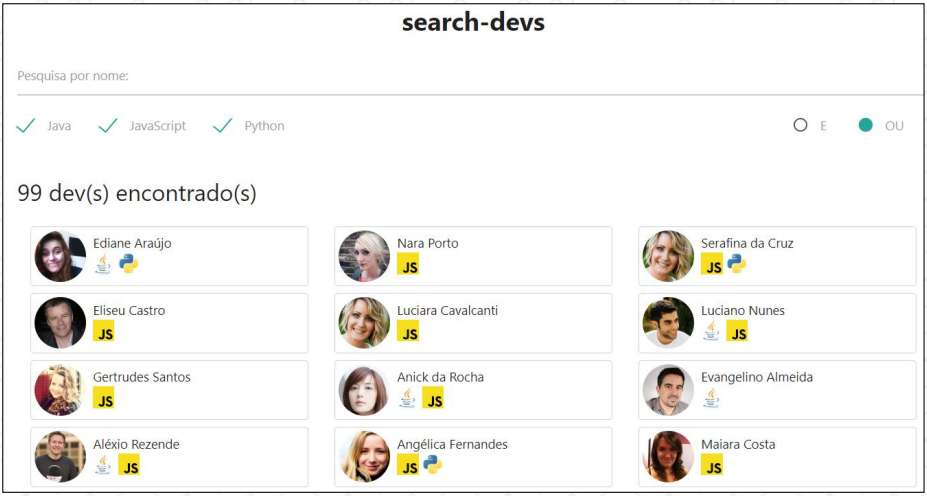
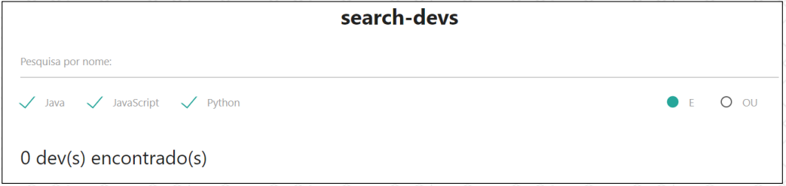
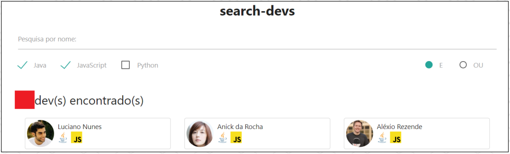
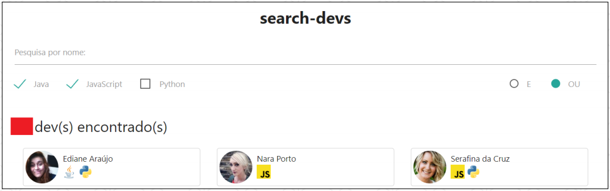
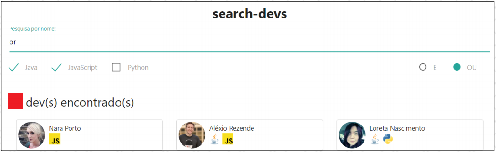

# Desafio - Módulo 01

## Enunciado

Criar uma aplicação para pesquisar desenvolvedores (dev's) com opções de filtragem.

## Objetivos

Exercitar os seguintes conceitos trabalhados no Módulo:

- [x] Declarar elementos HTML como: `h1`, `p`, `input`, `div`, `span` etc.
- [x] Estilizar o app com CSS.
- [x] Mapear elementos do DOM para serem manipulados com JavaScript.
- [x] Realizar diversos cálculos com array methods como `map`, `filter`, `some`, `forEach` e `includes`.
- [x] Realizar requisições HTTP com o comando `fetch` e utilização de `promises` ou `async`/`await`.
- [x] Sair da zona de conforto e pensar fora da caixa.

## Atividades

Os alunos deverão desempenhar as seguintes atividades:

1. "Subir" o backend, que será fornecido pelo professor e contém um arquivo `.json` com **99** dev's já definidos.

2. No frontend, carregar os dados dos dev's em memória através de acesso ao backend com o comando `fetch`.

3. Permitir a filtragem de dev's a partir de trechos do nome, através de um input de texto com interação do usuário, <u>considerando</u> o texto em minúsculo sem espaços em branco e <u>desconsiderando</u> acentos. Assim, o termo de busca "dre", deve trazer os dev's Andréia e André, por exemplo.

4. Permitir a filtragem de dev's através das linguagens de programação. Há dev's cadastrados que conhecem Java, JavaScript <u>e/ou</u> Python. Essa filtragem deve considerar os operadores lógicos <u>E</u> ou <u>OU</u>. Assim, se eu pesquiso por dev's que conhecem Java <u>E</u> Python, somente os dev's que conhecem ambas as linguagens devem ser retornados. Se eu pesquiso com <u>OU</u>, os dev's que conhecem somente uma das linguagens também devem ser retornados.

5. Para representar as linguagens de programação dos dev's, foram utilizados ícones, que também serão fornecidos pelo professor, sendo:

   - Java.
   - JavaScript.
   - Python.

6. As imagens abaixo ilustram exemplos de interface da aplicação em algumas situações possíveis. Foi utilizado o [Materialize](https://materializecss.com/) como ferramenta de CSS.

**Tela inicial da aplicação (sugestão):**

<p>
  
</p>

Considerando os dados fornecidos, não existe nenhum dev que conheça **Java <u>E</u> JavaScript <u>E</u> Python**:

<p>
  
</p>

Dev's que conhecem **Java <u>E</u> JavaScript** (são mais que 3):

<p>
  
</p>

Dev's que conhecem **Java <u>OU</u> JavaScript** (são mais que 3):

<p>
  
</p>

Perceba também a variação da combinação de linguagens de programação, pois há dev's que conhecem somente JavaScript e dev's que conhecem JavaScript E Python, por exemplo. Isso é válido quando <u>**OU**</u> está selecionado.

Busca com o texto "or", que filtrou Nara Porto, Aléxio Rezende (desconsiderando espaços em branco) e Loreta Nascimento, por exemplo:

<p>
  
</p>

## Dicas e sugestões

1. Lembre-se sempre de que há várias formas de se implementar um problema.
2. Após executar a requisição à API, faça uma transformação de dados com `map` e crie um campo adicional para usar como **busca**. Esse campo deve <u>**converter o nome para minúsculas e retirar os espaços em branco**</u>. Use esse campo adicional para localizar os dev's quando o usuário digitar no input.
3. Dê **prioridade** à **funcionalidade** e só depois dedique-se à **interface**.
4. A função [split](https://developer.mozilla.org/pt-BR/docs/Web/JavaScript/Reference/Global_Objects/String/split) pode converter uma `string` em `array`. A função [join](https://developer.mozilla.org/pt-BR/docs/Web/JavaScript/Reference/Global_Objects/Array/join) pode converter um `array` em `string`.
5. Utilize o evento `input` para filtrar os dados a partir da digitação do usuário.
6. Na minha opinião, a lógica mais complexa deste app é a filtragem de dev's utilizando **OR**. Para fazer isso, pense em conjuntos. Utilizando **OR, pelo menos uma das linguagens <u>marcadas</u>** (`array.some`) deve estar presente no conjunto de todas as linguagens (`array.includes`).
7. Tente ao máximo implementar o desafio **sozinho**, com o apoio do **fórum**. Em **último caso**, deixo um projeto bastante semelhante ao desafio [neste link](https://codesandbox.io/s/search-countries-4dfus), que pode servir de apoio e sanar algumas dúvidas. **Atenção: tenha certeza de que você vai <u>aprender muito mais</u> se implementar este desafio <u>sozinho</u>**.

## Implementando o Backend

Dentro da depência `backend/` irá contém um arquivo `devs.json`.

```
backend/
└── devs.json
```

1. Instale com o comando.

```
npm init -y
```

2. Instale a biblioteca [json-server](https://www.npmjs.com/package/json-server).

```
npm installl --save-dev json-server
```

3. No arquivo `package.json` crie o seguinte script:

```
"start": "json-server --watch devs.json --port 3001"
```

4. Inicie o projeto

```
npm start
```

5. Acesse o endereço [localhost:3001](http://localhost:3001/devs) fornecida pela biblioteca `json-server`.

As depêndencias deverão estar nessa estrutura:

```
backend/
├── node_modules/
├── devs.json
├── package-lock.json
└── package.json
```
