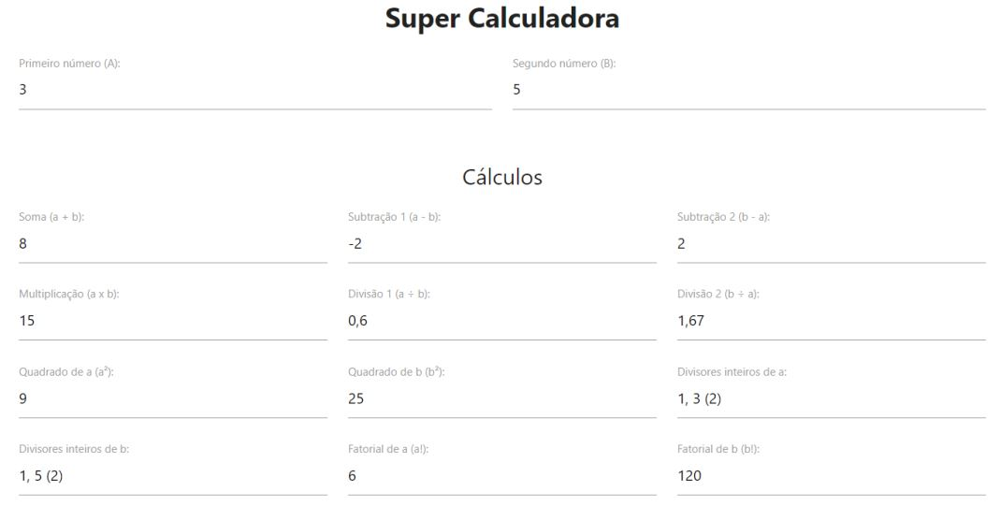

# Trabalho prático - Módulo 01

## Enunciado

Construa, utilizando HTML, CSS e JavaScript puro, uma aplicação denominada **Super Calculadora**.

## Objetivos

Exercitar os seguintes conceitos trabalhados no Módulo:

- [x] Utilização de elementos HTML.
- [x] Utilização de CSS.
- [x] Utilização de identificadores em elementos HTML.
- [x] Captura de referência de elementos com JavaScript.
- [x] Manipulação de eventos com JavaScript.
- [x] Implementação de funções com JavaScript

## Atividades

Os alunos deverão desempenhar as seguintes atividades:

1. **Implementar**, utilizando **HTML, CSS e JavaScript puro**, uma aplicação que efetue diversos cálculos através de dois números definidos pelo usuário, através de **dois inputs** do tipo `number`. Considere que os valores serão apelidados de **A** e **B** para melhor explicar os tópicos abaixo.

2. Esses cálculos devem ser exibidos em **12 inputs** de **texto somente-leitura**, que
   devem calcular, respectivamente:

- [x] O valor de **A + B**.
- [x] O valor de **A – B**.
- [x] O valor de **B – A**.
- [x] O valor de **A x B**.
- [x] O valor de **A / B**, indicando o valor "Divisão por 0" caso não seja possível dividir (**B === 0**).
- [x] O valor de **B / A**, indicando o valor "Divisão por 0" caso não seja possível dividir (**A === 0**).
- [x] O valor de **A²**.
- [x] O valor de **B²**.
- [x] Os divisores inteiros de **A** em forma de lista, separada por vírgulas e indicação da quantidade total entre parênteses.
- [x] Os divisores inteiros de **B** em forma de lista, separada por vírgulas e indicação da quantidade total entre parênteses.
- [x] O valor do fatorial de **A**, que deve ser calculado com A <= 21, somente. Indicar "Número muito grande" caso **A** > 21.
- [x] O valor do fatorial de **B**, que deve ser calculado com B <= 21, somente. Indicar "Número muito grande" caso **B** > 21.

3. A imagem abaixo ilustra uma possível interface para a aplicação. O layout foi feito Com o apoio da biblioteca [Materialize](https://materializecss.com/).

<p align="center">
	
</p>

## Dicas

- Existem várias maneiras de se resolver um problema. Dê mais prioridade ao código funcionando corretamente e menos prioridade à interface gráfica
- Exemplo de função para formatação de valores numéricos, utilizando a biblioteca nativa `Intl` do JavaScript. Para mais informações, verifique [este link](https://developer.mozilla.org/pt-BR/docs/Web/JavaScript/Reference/Global_Objects/Intl/NumberFormat):

```javascript
function formatNumber(number) {
  return new Intl.NumberForma("pt-BR").format(number);
}
```

- Para formatar um número para utilizar somente 2 casas decimais, utilize a função `toFixed(2)`. Envolva esse cálculo na função `formatNumber`, definida no tópico acima. Para mais informações, verifique [este link](https://developer.mozilla.org/pt-BR/docs/Web/JavaScript/Reference/Global_Objects/Number/toFixed).

- Para converter um array em string, pesquise e utilize a função `join`, nativa do JavaScript.

- Para converter um valor do formato `string` para `number`, recomenda-se a utilização da função `parseInt(value, 10)`. Para mais informações, verifique [este link](https://developer.mozilla.org/pt-BR/docs/Web/JavaScript/Reference/Global_Objects/parseInt).

- Procure apoio no respectivo **fórum do módulo** e auxilie os seus colegas. Isso contribui muito para o seu aprendizado!

- Caso ainda esteja com dificuldades para implementar o Trabalho Prático, acesse [este projeto online](https://codesandbox.io/s/names-analysis-75tco), que é bastante semelhante e pode ser útil. O código-fonte está bastante comentado e pode conter dicas extras. Nesse projeto, que na minha opinião é mais complexo que o Trabalho Prático, há alguns exemplos de funções que ainda não foram oficialmente vistas no módulo, tais como `split`, `reverse`, `filter` e `includes`. De qualquer forma, vale a pena pesquisar por elas para entendê-las melhor. Uma dica extra: tente implementar sozinho (com o apoio do fórum) e só recorra ao projeto online em último caso. <u>**Lembre-se de que você vai aprender muito mais se fizer sozinho**</u>.

## Ambiente

Veja aqui o a página do projeto implantado por @github-pages [ver implantação](https://jefersonlucas.github.io/trabalho-pratico-01/).
